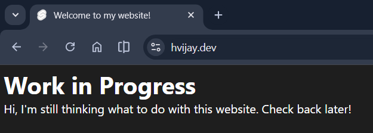
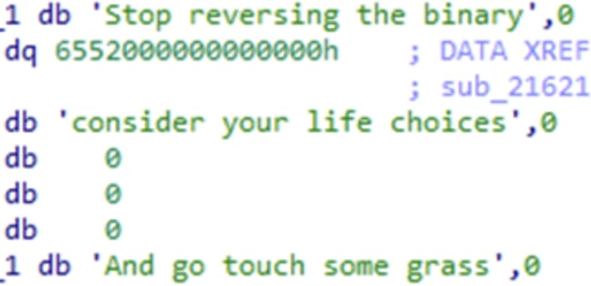

import BlogImage from "@components/BlogImage.astro";
export const components = { img: BlogImage };

Hello! I'm Harshul. It has been quite a while since I had registered this domain
(over a year from today). But I didn't know what to put here, so it was a blank
page all this time.

(this was a blatant lie btw)

Now that I _finally_ know what to put here, I'm setting up this blog. Honestly,
should've done this a long time ago.

I hope to publish my writeups for the various CTF challenges I solve here, among
any other things I like. New year, new me.

([not mine](https://x.com/i/status/2001406022057939212))

ps: didn't make the website. forked it from my cousin and made changes because
it looks cool.
